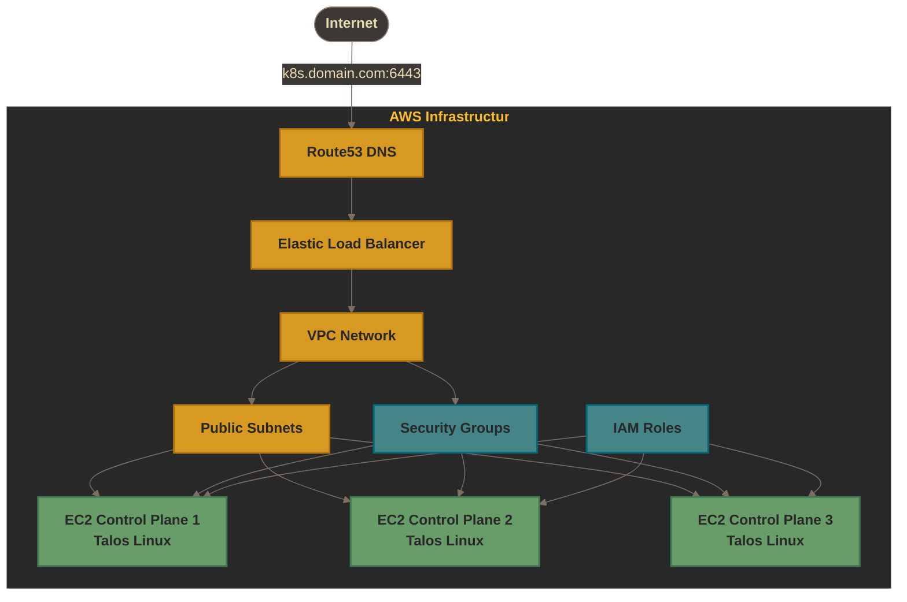
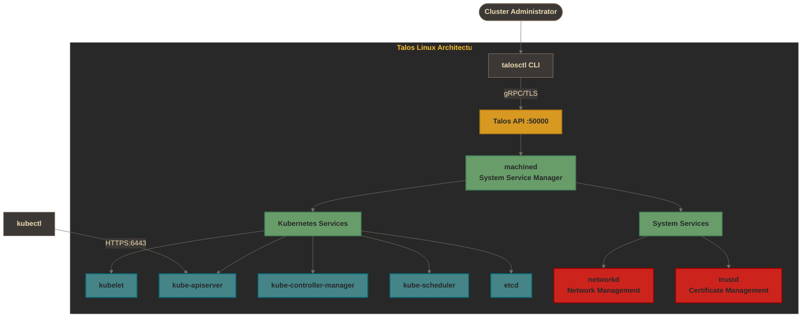
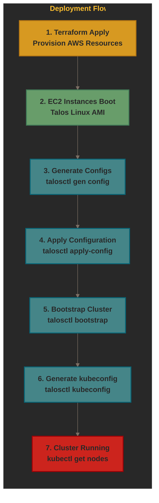
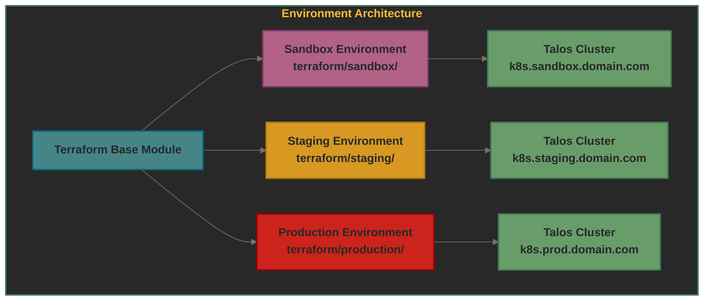

# :house: Architecture

This document outlines the infrastructure architecture for deploying Talos Linux Kubernetes clusters on AWS.

## System Overview

The template provides infrastructure for deploying a Talos Linux Kubernetes cluster with the following components:

```mermaid
%%{
  init: {
    'theme': 'base',
    'themeVariables': {
      'primaryColor': '#282828',
      'primaryTextColor': '#ebdbb2',
      'primaryBorderColor': '#7c6f64',
      'lineColor': '#7c6f64',
      'secondaryColor': '#3c3836',
      'tertiaryColor': '#504945'
    }
  }
}%%
flowchart TD
    subgraph SystemOverview["Talos Cluster Architecture"]
        subgraph InfraLayer["Infrastructure Layer"]
            TF[Terraform/OpenTofu] --> AWS[AWS Resources]
            AWS --> VPC[VPC Network]
            AWS --> EC2[EC2 Instances]
            AWS --> DNS[Route53 DNS]
        end

        subgraph OSLayer["Operating System Layer"]
            EC2 --> TALOS[Talos Linux v1.12.1]
            TALOS --> API[Talos API]
        end

        subgraph K8sLayer["Kubernetes Layer"]
            API --> K8S[Kubernetes Cluster]
            K8S --> CP[Control Plane]
            CP --> APISERVER[API Server]
            CP --> ETCD[etcd]
            CP --> SCHEDULER[Scheduler]
        end
    end

    %% Style definitions - Gruvbox Dark theme
    classDef infrastructure fill:#d79921,stroke:#b57614,stroke-width:2px,color:#282828,font-weight:bold
    classDef os fill:#689d6a,stroke:#427b58,stroke-width:2px,color:#282828,font-weight:bold
    classDef kubernetes fill:#458588,stroke:#076678,stroke-width:2px,color:#282828,font-weight:bold

    %% Apply styles
    class TF,AWS,VPC,EC2,DNS infrastructure
    class TALOS,API os
    class K8S,CP,APISERVER,ETCD,SCHEDULER kubernetes

    %% Explicit styling for subgraphs
    style SystemOverview fill:#282828,color:#fabd2f,font-weight:bold
    style InfraLayer fill:#282828,color:#fabd2f,font-weight:bold
    style OSLayer fill:#282828,color:#fabd2f,font-weight:bold
    style K8sLayer fill:#282828,color:#fabd2f,font-weight:bold
```

## AWS Infrastructure (Terraform)

The cloud infrastructure is managed with Terraform/OpenTofu, provisioning the following AWS resources:

### Infrastructure Components

- **VPC**: Isolated network with configurable CIDR blocks
- **Public Subnets**: Subnets across multiple availability zones for high availability
- **Security Groups**: Firewall rules for Kubernetes API (6443), Talos API (50000), and inter-node communication
- **EC2 Instances**: Control plane nodes running Talos Linux AMI
- **Elastic Load Balancer**: Load balances traffic to control plane nodes
- **Route53**: DNS records for cluster API endpoint (k8s.domain.com)
- **IAM Roles**: Permissions for EC2 instances to access AWS services

## Talos Linux Architecture

Talos Linux provides the operating system layer that creates and manages the Kubernetes cluster:

### Talos Components

- **machined**: Core system service that manages all other services
- **Talos API**: gRPC API for cluster management (port 50000)
- **kubelet**: Kubernetes node agent
- **kube-apiserver**: Kubernetes API server (port 6443)
- **kube-controller-manager**: Kubernetes controller manager
- **kube-scheduler**: Kubernetes scheduler
- **etcd**: Distributed key-value store for Kubernetes state
- **networkd**: Network configuration and management
- **trustd**: Certificate and PKI management

## Deployment Flow

This diagram shows the deployment process from infrastructure provisioning to running cluster:

## Environment Architecture

The project supports multiple environments with different configurations:

## Security Architecture

Talos Linux provides multiple layers of security:

1. **No SSH Access**: Impossible to SSH into nodes, eliminating a major attack vector
2. **Immutable File System**: Root filesystem is read-only and cannot be modified
3. **API Authentication**: All management operations require mutual TLS authentication
4. **Minimal Attack Surface**: Only runs Kubernetes components, nothing else
5. **Encrypted Communication**: All API communication is encrypted
6. **Certificate Management**: Automatic certificate rotation and management

## Network Architecture

Default ports and protocols:

- **6443**: Kubernetes API server (HTTPS)
- **50000**: Talos API (gRPC/TLS)
- **50001**: Talos Trustd API (gRPC/TLS)
- **2379-2380**: etcd client and peer communication
- **10250**: kubelet API

All inter-node communication is secured with TLS.
