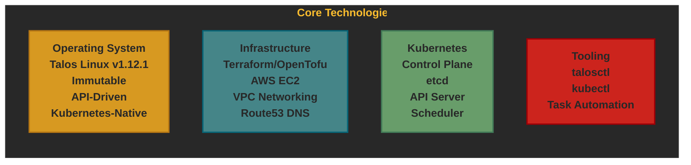

# :telescope: Project Overview

This project template provides infrastructure-as-code for deploying production-ready Talos Linux Kubernetes clusters on AWS. It's designed to quickly bootstrap new Kubernetes clusters with a standardized, secure, and immutable infrastructure.

## Purpose

The purpose of this template is to:

1. Provide a consistent starting point for new Kubernetes clusters
2. Implement security best practices with immutable infrastructure (Talos Linux)
3. Reduce cluster setup time from days to hours
4. Ensure infrastructure is defined as code from the beginning
5. Enable deployment to multiple environments (sandbox, staging, production)

## Core Technologies

## Design Principles

The template follows these design principles:

1. **Infrastructure as Code**: All infrastructure defined in Terraform
2. **Immutable Infrastructure**: Talos OS cannot be modified at runtime
3. **Security First**: No SSH access, minimal attack surface, API-only management
4. **Environment Parity**: Sandbox, staging, and production use identical base configuration
5. **Declarative Configuration**: All cluster configuration managed via talosconfig files
6. **API-Driven Operations**: All management operations via `talosctl` CLI

## How to Use This Template

1. Generate a new project using Copier with this template
2. Fill in the required variables (project name, AWS region, domain, etc.)
3. Configure AWS credentials
4. Deploy infrastructure with Terraform
5. Bootstrap Talos cluster with provided scripts
6. Deploy your applications to the cluster

For detailed instructions, see the [Deployment Documentation](./deployment.md).

## Key Features

- **Talos Linux v1.12.1** - Latest stable Talos OS with custom factory image
- **AWS Infrastructure** - VPC, EC2 instances, security groups, load balancers
- **Multi-Environment Support** - Sandbox, staging, and production configurations
- **Terraform/OpenTofu** - Infrastructure provisioning and state management
- **Custom Extensions** - ECR credential provider for AWS container registry
- **High Availability** - Configurable number of control plane nodes
- **Secure by Default** - API-only management, no SSH access
- **DNS Integration** - Automatic Route53 configuration

## What You Get

After deployment, you'll have:

- A fully functional Kubernetes cluster running on Talos Linux
- EC2 instances configured as Kubernetes control plane nodes
- VPC with proper networking and security groups
- DNS records for cluster API access
- `talosconfig` for cluster management
- `kubeconfig` for kubectl access
- Ready to deploy your workloads

## What This Template Does NOT Include

This is a **bare cluster template**. It does not include:

- Application deployments
- Database services
- Message queues
- Monitoring/logging solutions
- CI/CD pipelines
- Application load balancing

You can deploy any of these on top of the cluster once it's running.
